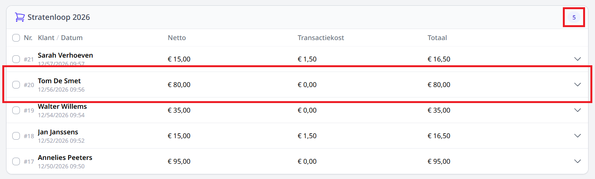
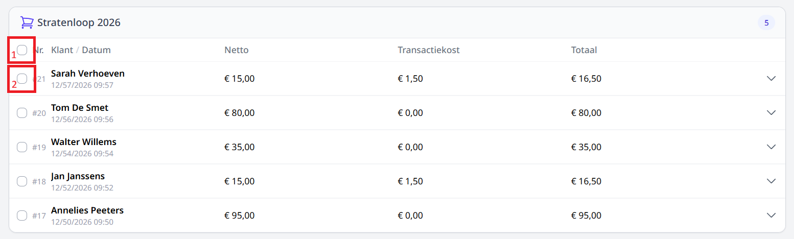
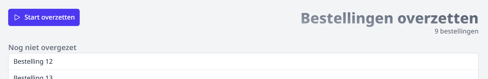
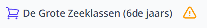
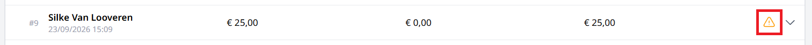

# Overzetten

Hier vind je een overzicht terug van al de betaalde bestellingen van alle webshops.

:::info noot
Dit onderdeel is enkel zichtbaar voor personeel met het gebruikersrecht **webshop_boekhouding**. dit recht kan toegewezen worden in de module [Gebruikersbeheer](/gebruikersbeheer)
:::

Rechtsbovenaan wordt er getoond hoeveel betalingen er nog overgezet moeten worden naar Exact Online voor die webshop. De som van deze aantallen vind je ook op de homepage van Toolbox bij de tegel van de module Webshop.

Klik op een bestelling rij om de bestellijnen voor die bestelling te tonen.

## Overzetten naar Exact Online

Enkel betaalde bestellingen in een webshop zonder [Foutmelding](/webshop/overzetten/#foutmeldingen) en artikelen zonder [foutmeldingen](/webshop/overzetten/#foutmeldingen)
kunnen overgezet worden naar Exact Online. Maak een selectie als je enkel bepaalde bestellingen wil overzetten.
heb je niets geselecteerd dan worden alle geldige bestellingen overgezet.

> 1.  Selecteer al de bestellingen van deze webshop.
> 2.  Selecteer deze bestelling.

Je wordt nu doorverwezen naar het overzetten overzicht. Druk op _Start overzetten_ om het overzetten naar Exact Online te starten.Enkel medewerkers met een account in Exact Online zullen de bestellingen effectief kunnen overzetten.
Het overzetten gebeurt op basis van de betaaldatum en niet de besteldatum.

### Foutmeldingen

staat er een foutmelding naast de naam van je webshop. Dan zijn de boekhoudgegevens voor deze webshop nog niet volledig ingevuld.

Geen enkele bestelling van deze webshop kan worden overgezet voor de parameters zijn ingevuld op de [webshop pagina](/webshop/webshopPagina).

staat er een foutmelding naar de bestelling. Dan zijn de boekhoudgegevens voor één of meerdere artikels voor deze bestelling nog niet volledig ingevuld.
Je kan op de bestellingrij klikken om te zien over welk artikel het gaat.

Deze bestelling kan niet worden overgezet voor de parameters zijn ingevuld in het [artikelbeheer](/webshop/artikelbeheer).

