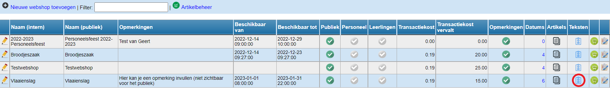

Per webshop kan je een aantal teksten instellen. Zo kan je een inleidende tekst instellen, maar ook een tekst die wordt weergegeven na de bestelling of een tekst om wat meer uitleg te geven bij het opmerkingenveld, indien dit actief is gezet. 

Klik daarvoor op het icoon <LegacyAction img="checklist.png" /> in de kolom 'Teksten'. 

Klik op 'wijzig teksten' om de teksten op te slaan. Teksten kunnen later via dezelfde werkwijze gewijzigd worden. 

De tekst na bestelling wordt op het scherm getoond onmiddellijk na de bestelling alsook in de bevestigingsmail. 

