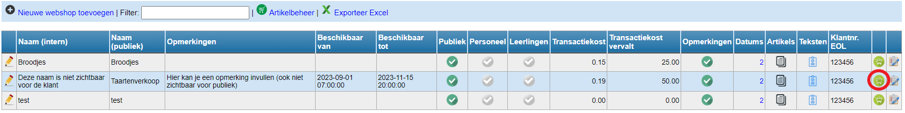
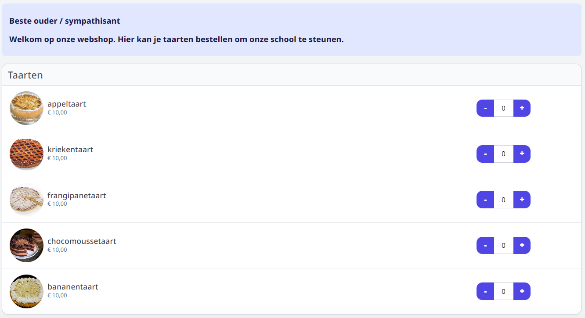

In elke fase van de opbouw van de webshop kan je bekijken hoe de gebruikersinterface eruit ziet. Klik daarvoor op het volgende icoon <LegacyAction img="webshop.png"/>.

De webshop zal openen in een nieuwe webpagina. Om de webshop te publiceren, kopieer je de url van deze webpagina. Die url kan je verspreiden via de gebruikelijke kanalen (e-mail, Smartschool, schoolwebsite, ...). Het is ook mogelijk om voor de webpagina een QR code te genereren. Die kan je b.v. gebruiken op een flyer, poster, ... . Bij het scannen van deze QR code zal men rechstreeks doorverwezen worden naar de webshop. Een QR code van een webpagina aanmaken, kan via een rechtermuisklik willekeurig ergens op de pagina. Kies voor 'QR code maken van deze pagina'.

:::info noot
De webshop is publiek toegankelijk voor iedereen met de link of QR code. 
:::