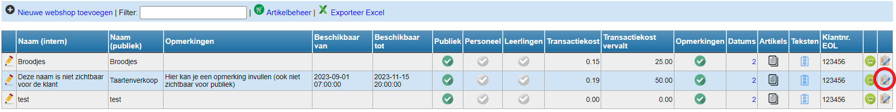
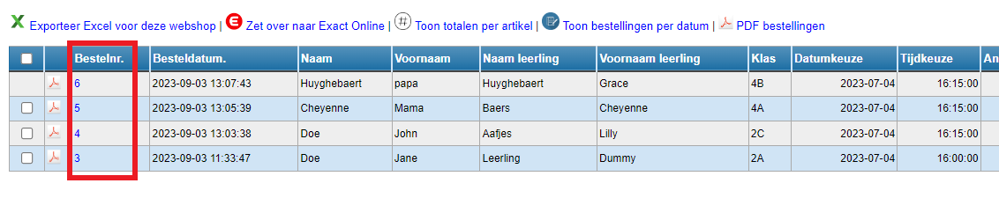

Klik op <LegacyAction img="list.png" /> om de bestellingen op te volgen.

Er wordt een overzicht getoond van alle bestellingen. Dit overzicht kan je exporteren naar Excel. 

### 1. Bestelformulier bekijken / betaallink opnieuw aanbieden

Klik op het bestelnummer om de bestelling in detail te bekijken. Wanneer een betaling mislukt is, kan je via deze detailstaat de betaallink opvragen en opnieuw aanbieden aan de klant. 

### 2. Bestelling verwijderen

Een betaalde bestelling kan **niet** meer verwijderd worden. Een niet-betaalde bestelling kan verwijderd worden via <LegacyAction img="remove.png"/>. 

### 3. Bestelling overzetten naar Exact Online
Enkel betaalde bestellingen kunnen overgezet worden naar Exact Online. Vink de bestellingen aan en klik op <LegacyAction img="exact.png" text="Zet over naar Exact Online"/>. Je wordt nu doorverwezen naar de inlogpagina van Exact Online (EOL). Enkel medewerkers met een account in EOL zullen de bestellingen effectief kunnen overzetten.  

### 4. Totaal aantal bestellingen per artikel

Klik op <LegacyAction img="aantal.png" text="Toon totalen per artikel"/> om per webshop het totaal aantal bestellingen per artikel te raadplegen. Dit is een handig overzicht om als school zelf de bestelling te kunnen plaatsen bij de leverancier. Er wordt een onderscheid gemaakt tussen de betaalde en niet-betaalde bestellingen.  

