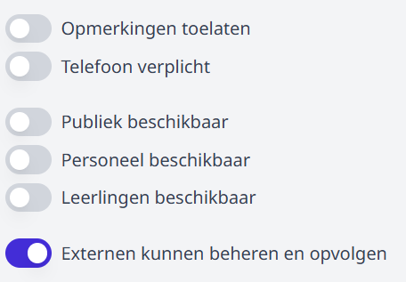

# Externen
## Rechten
Het mogelijk om externen een webshop te laten beheren moet hiervoor er in de module [Gebruikersbeheer](/gebruikersbeheer/#2-externen) het recht **webshop_beheer** zijn toegekend aan de juiste externen.

Wanneer een externe enkel de geplaatste bestellingen moet kunnen opvolgen, kan het gebruikersrecht **webshop_bestellingen_opvolgen** worden toegekend.

## Webshop aanmaken
Om externen toegang te geven tot een bepaalde webshop zal een personeelslid met gebruikersrechten eerst een webshop moeten aanmaken en de optie **Externen kunnen beheren en opvolgen** aanvinken. 

Hierna is de webshop voor de externen met de nodige rechten zichtbaar in het [webshopbeheer](/webshop/beheer) en kan de externe de rest van de info voor de webshop ingeven en/of de bestellingen opvolgen.

