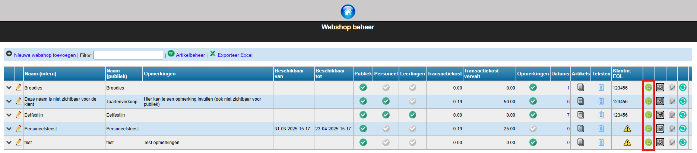
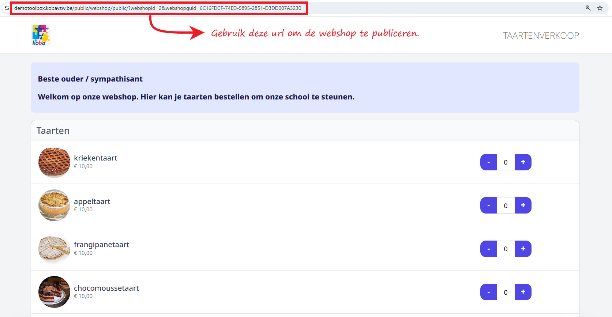

In elke fase van de opbouw van de webshop kan je bekijken hoe de gebruikersinterface eruit ziet. Klik daarvoor op het volgende icoon <LegacyAction img="webshop.png"/>.

De webshop zal openen in een nieuwe webpagina. Om de publieke webshop te publiceren, kopieer je bovenaan de url van deze webpagina. Die url kan je verspreiden via de gebruikelijke kanalen (e-mail, Smartschool, schoolwebsite, ...). Het is ook mogelijk om voor de webpagina een QR code te genereren. Die kan je b.v. gebruiken op een flyer, poster, ... . Bij het scannen van deze QR code zal men rechstreeks doorverwezen worden naar de webshop. Een QR code maken van een webpagina kan in de meeste browsers via een rechtermuisklik willekeurig ergens op de pagina. Kies voor 'QR code maken van deze pagina'. Je kan ook een gratis QR code generator gebruiken. Er zijn via het internet tal van websites te vinden om een url om te zetten naar een QR code.  

:::info noot
De webshop is publiek toegankelijk voor iedereen met de link of QR code. 
:::

:::caution opgelet
Gebruik nooit de url uit de webshop voor personeel om te verspreiden! Die bevat jouw persoonlijke gegevens. 
::: 