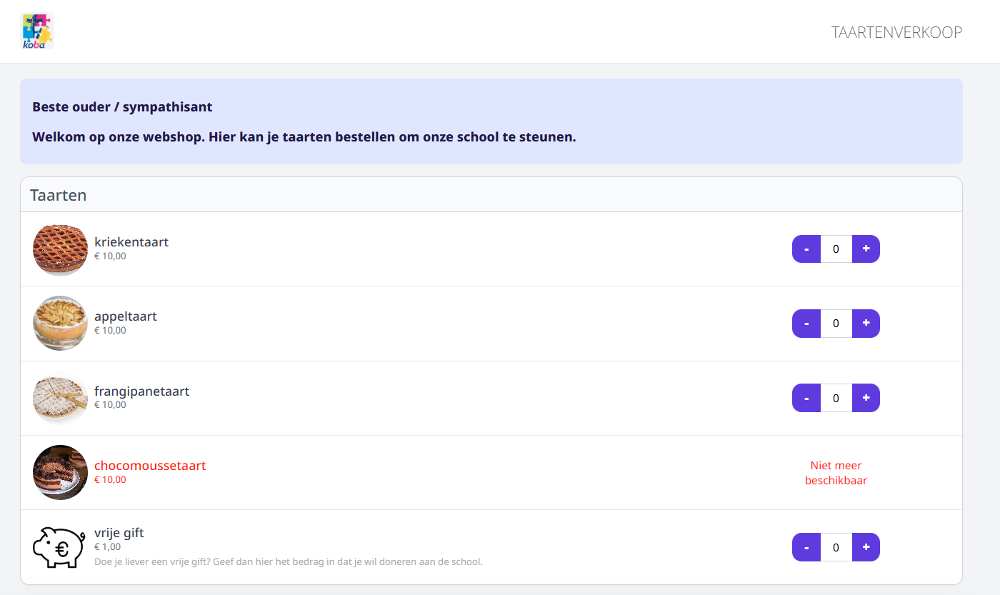

## Webshop bekijken

In elke fase van de opbouw van de webshop kan je bekijken hoe de gebruikersinterface eruit ziet. Klik daarvoor op het volgende icoon <LegacyAction img="webshop.png"/> achter de betreffende webshop.

*Klik op de afbeelding om te vergroten.*

De webshop zal vervolgens openen in een nieuwe webpagina. 

## Webshop publiceren

Een **webshop voor leraren** hoeft niet gepubliceerd te worden. Die is onmiddellijk beschikbaar in de module Webshop in Toolbox. Leraren raadplegen de webshop dus via Toolbox en niet via een aparte link naar een webpagina. 

Om een **publieke webshop** te publiceren, kan je bovenaan de url van deze webpagina kopiëren. Je kan diezelfde url terugvinden via het webshopbeheer met behulp van het QR code-icoontje achteraan. In een pop-up verschijnt de link die je kan kopiëren en de QR code die je kan downloaden

De url kan je verspreiden via de gebruikelijke kanalen (e-mail, Smartschool, schoolwebsite, ...). De QR code kan je b.v. gebruiken op een flyer, poster, ... . Bij het scannen van deze QR code zal men rechstreeks doorverwezen worden naar de publieke webshop.  

*Klik op de afbeelding om te vergroten.*

 

:::info noot
De webshop is publiek toegankelijk voor iedereen met de link of QR code. 
:::

:::caution opgelet
Gebruik **NOOIT** de url uit de webshop voor personeel om de link naar de publieke webshop te verspreiden! Die bevat namelijk jouw persoonlijke gegevens. 
::: 