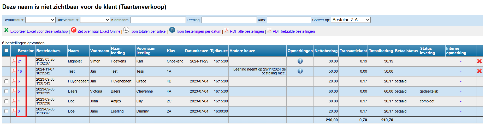
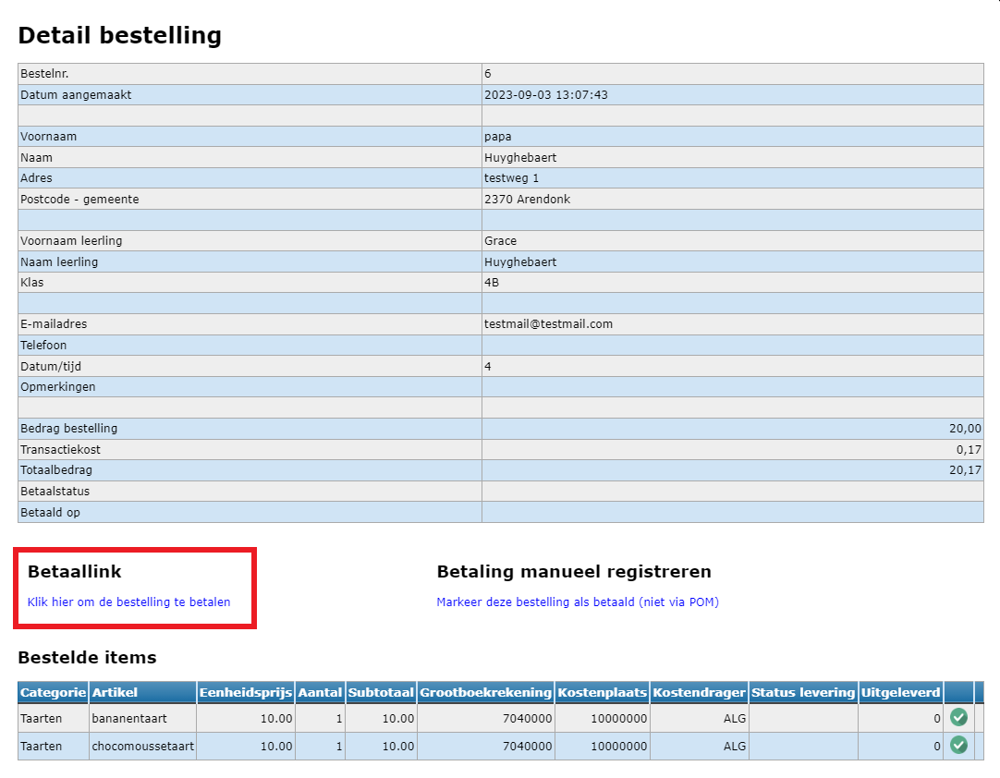
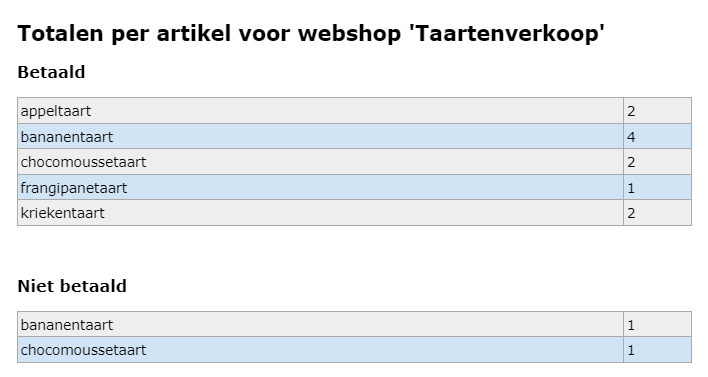

Klik op <LegacyAction img="list.png" /> om de bestellingen op te volgen.

Er wordt een overzicht getoond van alle bestellingen. Dit overzicht kan je exporteren naar Excel. 

### 1. Bestelformulier bekijken / betaallink opnieuw aanbieden

Klik op het bestelnummer om een bestelling in detail te bekijken. Wanneer een betaling mislukt is, kan je via deze detailstaat de betaallink opvragen en opnieuw aanbieden aan de klant. 

Klik op het PDF-icoon vóór het bestelnummer om de detailstaat van de bestelling (bestelbon) als PDF-document te downloaden. Via de PDF-knop bovenaan genereer je ineens één document met alle bestelbonnen of een bestand met enkel de betaalde bestellingen. 

### 2. Klantgegevens wijzigen

Een beheerder kan foutieve klantgegevens aanpassen. Hiervoor ga je naar het overzicht met bestellingen en open de bestelling waarvoor je de klantgegevens wil wijzigen door op het bestelnummer te klikken. Klik vervolgens bovenaan op 'Wijzig klantgegevens'. 

### 3. Bestelling verwijderen

Een betaalde bestelling kan **niet** meer verwijderd worden. Een niet-betaalde bestelling kan verwijderd worden via <LegacyAction img="remove.png"/>. 

### 4. Bestelling manueel op 'betaald' zetten

In uitzonderlijke gevallen kan een school toestaan om een bestelling toch contant te betalen. In dat geval moet de bestelling alsnog geplaatst worden via de webshop (door de klant of door de school). Die bestelling zal uiteraard niet onmiddellijk digitaal betaald worden. De onbetaalde bestelling zal toch in de bestellijst terecht komen, weliswaar als onbetaald. Door de bestelling te openen (door op het bestelnummer te klikken) kan je die manueel de status betaald geven waarna ze kan overgezet worden naar Exact Online. 

:::danger opgelet
De contante betaling zal je ook nog in het kasdagboek of in de module Kas van Toolbox moeten registreren. 
:::

### 5. Bestelling overzetten naar Exact Online
Enkel betaalde bestellingen kunnen overgezet worden naar Exact Online. Vink de bestellingen aan en klik op <LegacyAction img="exact.png" text="Zet over naar Exact Online"/>. Je wordt nu doorverwezen naar de inlogpagina van Exact Online (EOL). Enkel medewerkers met een account in EOL zullen de bestellingen effectief kunnen overzetten. Het overzetten gebeurt op basis van de betaaldatum en niet de besteldatum. 

### 6. Totaal aantal bestellingen per artikel

Klik op <LegacyAction img="aantal.png" text="Toon totalen per artikel"/> om per webshop het totaal aantal bestellingen per artikel te raadplegen. Dit is een handig overzicht om als school zelf de bestelling te kunnen plaatsen bij de leverancier. Er wordt een onderscheid gemaakt tussen de betaalde en niet-betaalde bestellingen.  

### 7. Bestellingen opvolgen per datumkeuze 

Werk je met datumkeuzes of alternatieve keuzes, dan kan een overzicht per keuzemoment handig zijn. Klik daarvoor op de knop <LegacyAction img="contract.png" text="Toon bestellingen per datum"/>.

Ook hier is het mogelijk om via het bestelnummer de details van elke bestelling op te vragen.

### 8. Bestelling uitleveren

Bij het openen van een bestelling (door te klikken op het bestelnummer) is het mogelijk om per besteld artikel aan te duiden of dat volledig of gedeeltelijk (met aantal) werd uitgeleverd. Op basis daarvan wordt de 'status levering' van de bestelling berekend. Op die manier kan je op een overzichtelijke manier opvolgen welke bestellingen volledig uitgeleverd zijn, welke gedeeltelijk en welke nog helemaal niet.

- Klik op <LegacyAction img="vinkjeGroenRond.png"/> om een bestellijn volledig uit te leveren. 

- Klik op <LegacyAction img="aantal.png"/> om een bestellijn gedeeltelijk uit te leveren. In een pop-upvenster kan je ingeven hoeveel artikels er precies werden uitgeleverd. 

- Klik op <LegacyAction img="undo.png"/> om de uitlevering terug ongedaan te maken. 

Ook in het overzicht met alle bestellingen zal je de status van levering kunnen opvolgen. 

