<ImageTitle img="weddecontrole.png">Weddecontrole</ImageTitle>

Met behulp van deze module kan je op een eenvoudige manier de weddelistings controleren en de fouten op een efficiënte manier opvolgen.
Om gebruik te kunnen maken van deze module is in Toolbox het gebruikersrecht 'weddecontrole' nodig. Een beheerder in de Toolbox kan dat recht toekennen via de module [Gebruikersbeheer](/gebruikersbeheer).

## Nieuw weddebestand uploaden

Vooraleer je een weddebestand kan nakijken, moet je het uploaden in Toolbox. Het bestand zelf kan je opvragen via 'Mijn onderwijs'. Dat bestand moet je opslaan als CSV-bestand. Kies hiervoor de optie 'CSV UTF-8 (door komma's gescheiden)'.

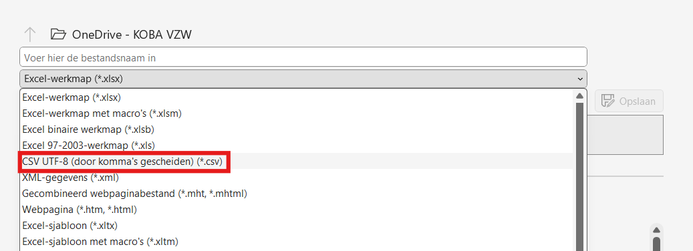

Kies in Toolbox de optie '+ Nieuw weddebestand uploaden'. 

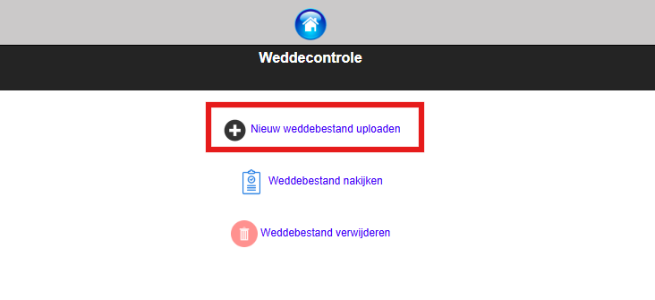

Geef het bestand een duidelijke naam en voeg het bestand toe dat je eerder downloadde via 'Mijn onderwijs' met behulp van de knop 'Bestand kiezen'. Klik vervolgens op 'Bestand uploaden'. Het weddebestand is nu beschikbaar om te controleren. 

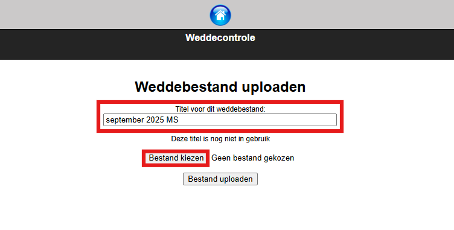

## Weddebestand nakijken

Kies de optie 'Weddebestand nakijken' om een bepaalde weddelisting te controleren. 

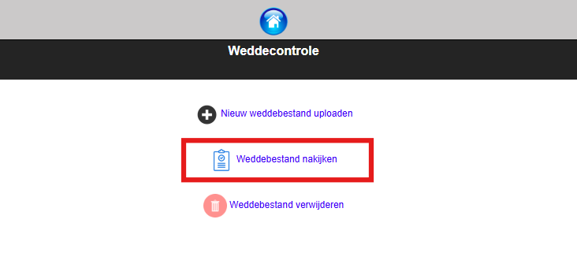

Selecteer met behulp van het pijltje het gewenste bestand uit de lijst.  

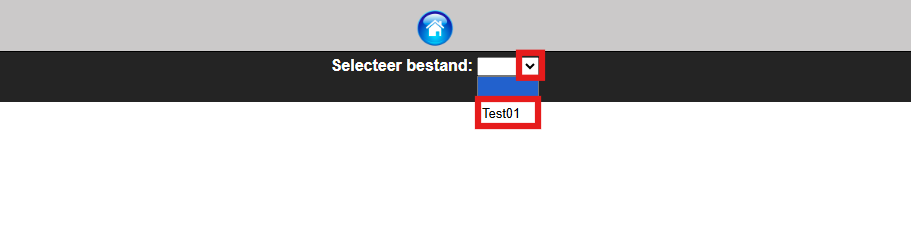

Als je het bestand voor het eerst gaat controleren, gebruik je het achterste pijltje. Uit de dropdownlijst kan je het gewenste personeelslid selecteren. Je kan ook beginnen bij het eerste personeelslid en daarna telkens op de optie 'Volgende' klikken. Dan zal Toolbox één voor één de  volledige lijst met personeelsleden doorlopen.

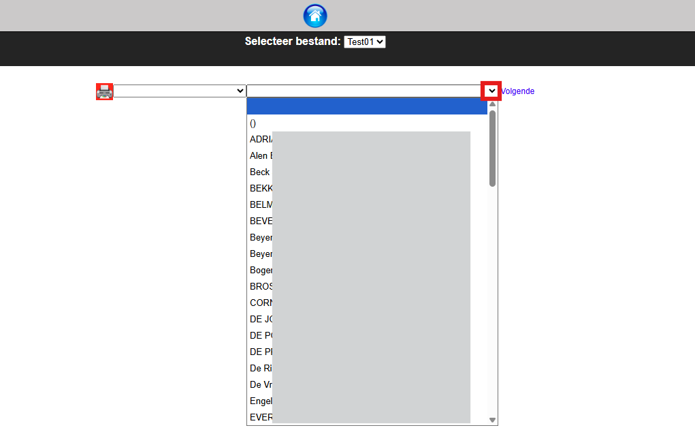

Bovenaan zie je de persoonsgegevens van het personeelslid. Voor elk personeelslid kan je aangeven of de weddeberekening wel of geen fouten bevat. Je kan in beide gevallen ook een opmerking meegeven in het tekstvak. Klik onderaan op 'Opmerkingen opslaan' om te bewaren. 

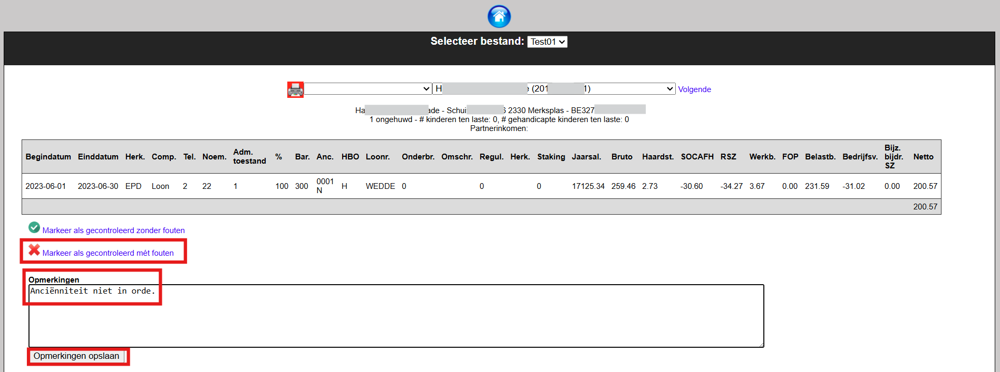
*Klik op de afbeelding om te vergroten.*

Wanneer er reeds controles gebeurd zijn, kan je filteren op 'gecontroleerd met fouten' en/of 'gecontroleerd zonder fouten'. 
Klik achteraan op het pijltje om te zien voor welke personeelsleden er al dan niet fouten genoteerd zijn. 

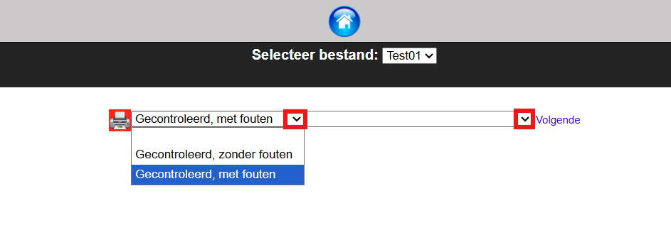

Je kan steeds de controle resetten en/of de opmerking wijzigen. 

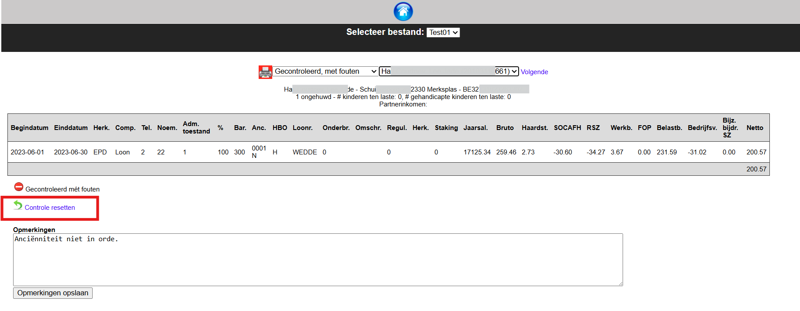
*Klik op de afbeelding om te vergroten.*

## Weddebestand verwijderen

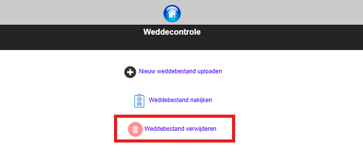

Selecteer het gewenste bestand uit de dropdownlijst om het te verwijderen.

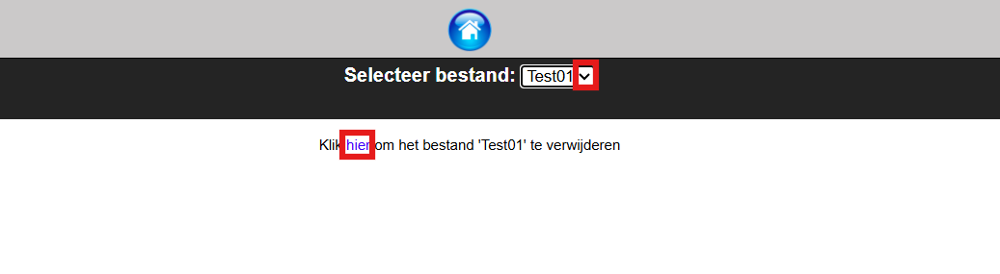

