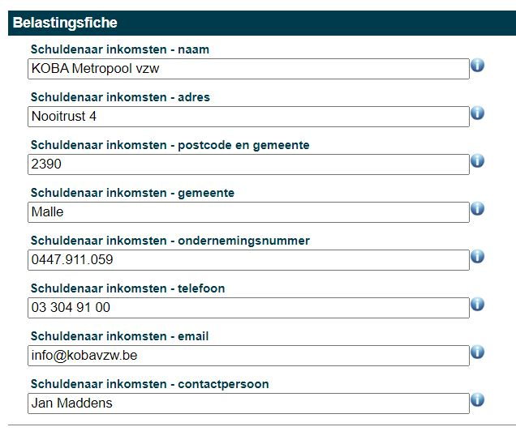

<ImageTitle img="belcotax.png">Woon-werkverkeer en Belcotax</ImageTitle>

In de module Woon-werkverkeer komen de totalen van de modules [Fietsvergoeding](./fietsvergoeding) en [Openbaar vervoer](./openbaar_vervoer) samen. Vanuit deze module kan je de fiscale fiches 281.10 downloaden of beschikbaar stellen voor het personeel, de Belcotax XML bestanden genereren en ook het document voor de terugvordering aanmaken.

## Instellingen 

Om correcte fiches te genereren, moeten er eerst een aantal zaken worden ingesteld in de module Instellingen.

Zoek in de module Instellingen naar 'Woon-werkverkeer'. Vul vervolgens alle gevraagde gegevens in, zowel van de schuldenaar als van de afzender. In de praktijk zullen deze twee meestal dezelfde zijn. Let op dat je hier de gegevens van de VZW invult en niet van de school. De VZW is namelijk de werkgever. Selecteer onderaan ook het inkomstenjaar (2022) waarvoor de personeelsleden via de module Openbaar vervoer of de module Fietsvergoeding de fiscale fiche kunnen downloaden. 

## Synchronisatie leraren

Daarnaast is het belangrijk om via de module Synchronisatie Leraren de eerste 2 stappen van het synchronisatieproces nog eens te doorlopen, zodat alle personeelsgegevens correct zijn opgehaald. 

- Stap 1. Informat/Wisa uitlezen
- Stap 2. Synchroniseer leraren

## Fiscale fiches aanmaken

Het aanmaken van de fiches zelf gebeurt in de module Woon-werverkeer beheer.

Selecteer bovenaan eerst het inkomstenjaar waarvoor je fiscale fiches wenst aan te maken.

Klik vervolgens op de blauwe tekst om de kosten uit Exact Online op te halen. 

Je krijgt nu een overzicht van alle personeelsleden die in de loop van het geselecteerde inkomstenjaar een fietsvergoeding, vergoeding openbaar vervoer, een terugbetaling van kosten eigen aan de werkgever (bv. voor dienstverplaatsing) of voordelen alle aard hebben genoten. Het bedrag voor fietsvergoeding en openbaar vervoer ligt vast en kan in deze module niet meer worden gewijzigd. De overige velden zijn nog wel bewerkbaar. De bedragen die hier zijn ingevuld, werden overgenomen uit Exact Online. Kijk deze zeker goed na! 

:::caution
Wanneer een personeelslid voor meerdere scholen binnen eenzelfde vzw werkt, zullen de bedragen voor beide scholen zijn geïmporteerd (dubbel dus). Spreek in zulke gevallen met de andere school goed af wie welke bedragen op de fiche vermeldt.
:::

Wanneer een personeelslid helemaal geen fiscale fiche hoeft te krijgen, kan je die uit de lijst verwijderen door achteraan op het rode kruisje <LegacyAction img="remove.png"/> te klikken. 

Wanneer een school meerdere instellingsnummers heeft en een personeelslid heeft een opdracht verdeeld over de twee instellingsnummers, moet je in de kolom 'school' nog een instelling selecteren. Wanneer dat nog niet is gebeurd, is de tekst rood. Als dat wel in orde is gebracht, ziet het eruit zoals hieronder. De zwarte vette letters geven de geselecteerde school weer. In dit geval **BB** voor bovenbouw. Deze instelling is niet zo zeer van belang voor de fiscale fiches, maar wel voor de terugvordering van de kosten voor openbaar vervoer en fietsvergoeding van AGODI. De geselecteerde school ontvangt de terugbetaling.

Selecteer tot slot alle personeelsleden en klik bovenaan op <LegacyAction img="belcotax.png" text="Belcotax XML aanmaken"/>. Selecteer vervolgens nog voor welke school je het XML-bestand wil aanmaken en klik op 'Genereer bestand'. 

Het XML-bestand wordt nu gedownload. Je kan het terugvinden links onderaan je scherm of in de map 'downloads' op je computer.

Om het bestand te kunnen indienen bij Belcotax-on-web moet het XML-bestand nog worden omgezet naar een BOW-bestand. Hoe je dat doet, lees je [hier](https://www.tbvs.be/downloads/Xml_naar_bow.pdf). Dit BOW-bestand moet worden opgeladen via de online toepassing van Belcotax on web. 

:::important
Het terugvorderderingsdocument mag niet meer per post of per e-mail aan AGODI worden bezorgd. De terugvordering moet worden aangevraagd via Mijn Onderwijs. 
:::
